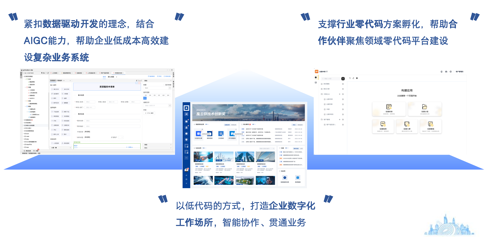
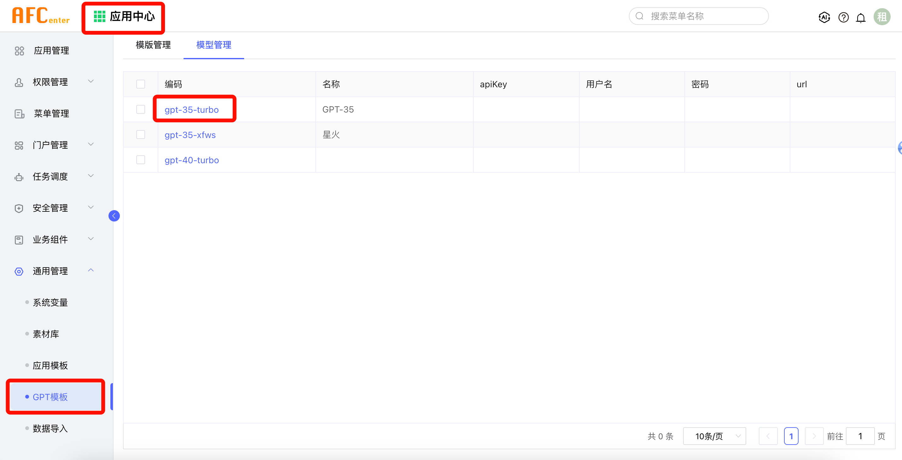

# EOS_LOWCODE

[](/LICENSE)

## 介绍

EOS_LOWCODE是一款由普元软件主导的低代码产品，紧扣模型驱动开发的理念设计，旨在让更多用户快速私有化的构建专业系统。

平台使用前后端分离技术，拥抱云原生生态，具备高可靠、高性能等特征，目前已广泛用于金融、央国企、政务、制造、能源等行业，对客户管理类、交易类、数据类等多种系统提供低代码支撑。

EOS低代码社区版则通过简化云原生部署架构，以容器方式提供主体能力，同时融入AI助手，以完全在线的方式，帮助用户更快的构建特色业务系统。



## 快速开始

#### 1、数据库初始化
- 使用Mysql5.7+，Mysql的SQL_MODE中注意不要包括NO_ZERO_DATE，创建database时，建议字符集（CHARACTER SET）选择utf8，字符排序（COLLATE）选择utf8_bin。
- 下载

#### 2、容器启动
```python
$ docker run -d --name eoslowcode -e JAVA_OPTS="-server -DDB_URL=jdbc:mysql://[ip]:[port]/[schema]?characterEncoding=utf8&useSSL=false -DDB_USER=[db_user] -DDB_PASSWD=[db_password]" -p 28079:28079 registry.cn-shanghai.aliyuncs.com/primeton-pub/eoslowcode:8.3.0
```
容器启动后访问
- [http://localhost:28079](http://localhost:28079)
- 用户名/密码: admin/000000
- 首次访问需更改默认密码


## 功能特性
#### 1、开发中心
通过低代码在线IDE模式，提供快速配置实体、表单、视图、服务、流程等能力，支持多端渲染，支持将资源快速发布成菜单使用。

#### 2、组织中心
提供机构、人员、岗位、工作组、账号管理能力，支持多维组织模式，支持对账号的细粒度管控。

#### 3、应用中心
管理低代码应用内的各类资源，支持对菜单、接口、数据资源等进行统一授权管理，对平台使用进行各类安全设置，支持统一任务调度、业务字典、系统变量等。

#### 4、流程中心
提供待办、已办、草稿、抄送等通用流程能力，支持对流程引擎的管理配置，支持流程定义的业务化配置发布，支持常用意见、消息的模板设置。

#### 5、工作台
提供工作台门户的配置和展示能力，支持多种门户布局，支持多工作台切换，提供常用widget组件，包括但不限于工作日历、最近使用、快捷入口等。

## 社区版VS企业版
功能 | 社区版 | 企业版 &emsp; [:phone:联系我们](https://www.primeton.com/)
---|:---:|:---:
数据库支持| mysql5.7+ | mysql5.7+、oracle11g+、dm8、gauss9
浏览器支持| chrome | chrome、firefox、edge
实体建模| :white_check_mark: | :white_check_mark:
页面开发| :white_check_mark: | :white_check_mark:
流程开发| :white_check_mark: | :white_check_mark:
服务开发| :white_check_mark: | :white_check_mark:
统一组织机构| :white_check_mark: | :white_check_mark:
统一资源授权| :white_check_mark: | :white_check_mark:
统一工作台| :white_check_mark: | :white_check_mark:
应用数量| 1 | 不限
应用数据源| 1 | 不限
应用并发| 20 | 不限
报表大屏设计| :x: | :white_check_mark:
生成离线工程| :x: | :white_check_mark:
应用监控治理| :x: | :white_check_mark:
集群部署| :x: | :white_check_mark:
AI助手| 需独立申请 | 产品默认提供

## AI助手服务申请
如果你要使用AI能力来辅助日常使用或应用开发，可通过[在线申请](http://139.224.253.89:28079)获取AI相关配置，目前社区版只提供gpt-35-turbo服务，在收到AI信息的邮件后，将其配置到下图门户功能中，即可使用AI助手能力。

PS: 只需输入apiKey和url信息，AI服务每日有流量限制，请勿随意调用。




## 联系我们
如果你喜欢EOS_LOWCODE产品，可以从社区版开始试用，我们会努力维护社区版的稳定，后期在不影响公司商业的前提下，会逐步开放产品模块源码。

如果你发现产品有任何Bug，可通过Issues向我们反馈。

如果你希望使用企业版或得到更多服务，可致电 4008205821 或访问[普元官网](https://www.primeton.com/)。
